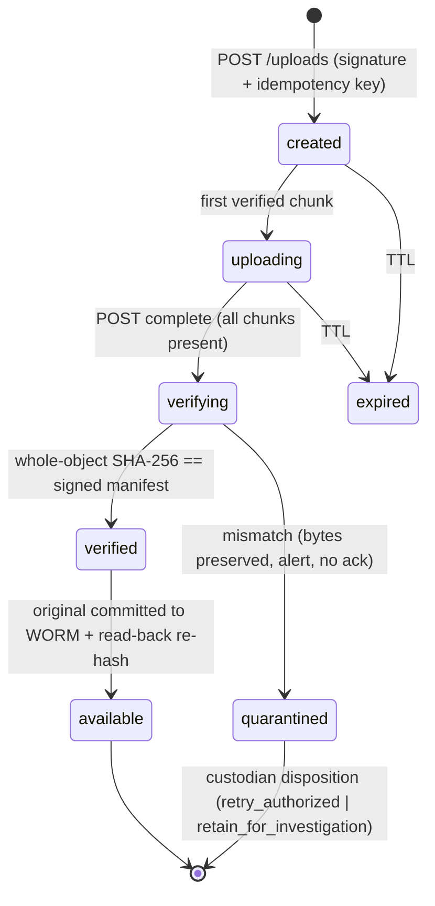
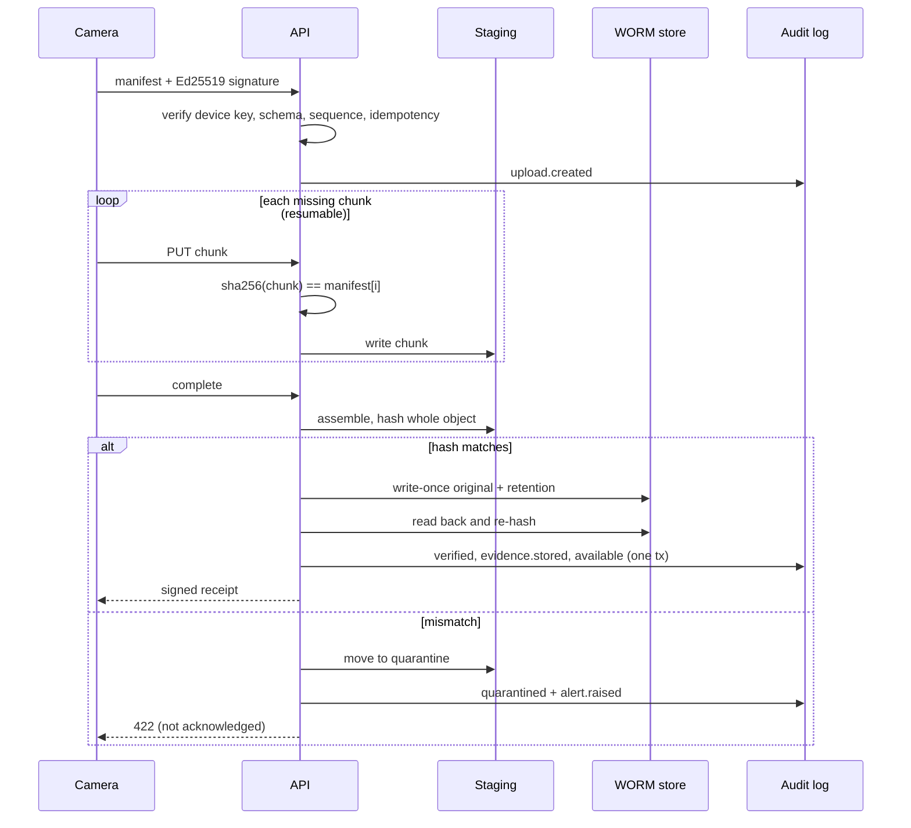

# Architecture

## Trust boundaries
Untrusted: network, device clock, chunk bytes, anything in staging. Trusted-by-attestation: the device
signing key (secure element), verified against the registry. Trusted: the service after verification,
the WORM store, the audit chain. Nothing in staging is evidence until it is verified and committed.

## Upload state machine (every edge = one transaction that also appends an audit row)

## Sequence

## Key decisions
1. **Device signs the manifest** (metadata + every chunk hash + object hash) before sending a byte, so
   metadata is immutable and attributable, and the server can reject a bad chunk immediately.
2. **Retries reuse the same signed manifest.** Idempotency is `(device, key)` bound to the manifest hash;
   the same key with different content is a conflict *and* an alert. Same capture under a new key is
   de-duplicated by `(device, sequence_no, sha256)`.
3. **Ack after durability + verification.** The receipt is signed by the service; the SDK refuses to
   return success unless it verifies and matches the local hash. Cameras purge only on that receipt.
4. **Audit atomicity.** State change and audit row share a transaction; hash chain + signed checkpoints
   give tamper *evidence* even against a DBA (tested by dropping triggers). Anchor checkpoints
   off-box (`deploy/terraform`, anchors bucket).
5. **Deterministic decisions, advisory AI.** See README.
6. **Device clock is untrusted.** Server receipt time is authoritative; future-dated captures are flagged
   (not rejected: legitimate offline uploads are late, never early).
7. **Separation of duties is structural:** admin ≠ evidence access; auditor ≠ bytes; hold requester ≠
   approver ≠ releaser; device registrar ≠ activator.

## Scale-out mapping (production)
API pods behind mTLS/OIDC gateway → PostgreSQL (REVOKE UPDATE/DELETE on audit tables, logical replication
to an independent audit sink) → S3 Object Lock COMPLIANCE + SSE-KMS (cross-region replication for
regional outage; RPO/RTO set by replication lag) → staging on ephemeral/EFS volumes → fixity + checkpoint
CronJob. Upload volume drives chunk size and parallelism; retention classes map to policy.

## Known limits
* SQLite metadata store is single-writer (k8s manifest is `replicas: 1`). Move to PostgreSQL for HA.
* `S3WormStore` is unit-tested with a stub only; validate against Object Lock before use.
* Dev bearer tokens; production must terminate OIDC/mTLS and map claims to `Principal`.
* Signing keys are env-provided; production keys belong in KMS/HSM with rotation (`key_id` is recorded).
* No gRPC front door yet (REST/OpenAPI only); the service layer is transport-agnostic.
* Disposition/purge is intentionally unimplemented; `is_disposable()` supports an offline dual-approved process.
* Rate limiting and WAF are expected at the gateway.
