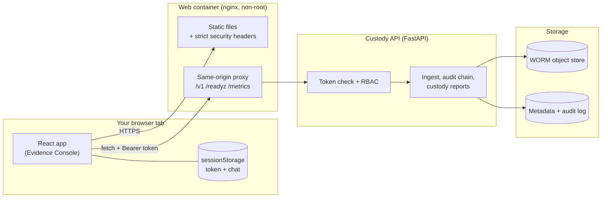
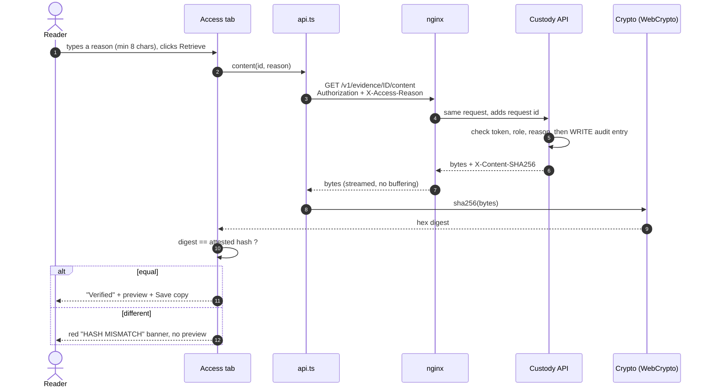
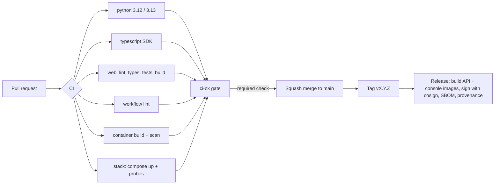

# Evidence Console: Solution Deep Dive

*A guided tour of the browser front end for the Evidence Custody service. Written for someone who has never seen the project. No prior React, security or evidence-handling knowledge assumed.*

> **How to read this.** Sections 1 to 9 explain the ideas. Section 10 is the **screen atlas**: a wireframe (an artboard, in Figma terms) for every screen and every important state, each with its purpose, its place in the workflow, and what the person can do there. Section 11 onward covers quality, shipping, running and limits.
> **Honesty note.** The wireframes are drawn from the code as built (`web/src/pages/*`). Nothing here was rendered in a real browser during authoring; see `SRS-Compliance.md` for what was and was not verified.

## Contents
1. [What the console is for](#1-what-the-console-is-for)
2. [The big picture](#2-the-big-picture)
3. [Glossary](#3-glossary)
4. [A tour of the `web/` folder](#4-a-tour-of-the-web-folder)
5. [The life of one click](#5-the-life-of-one-click)
6. [Sign-in, roles and browser security](#6-sign-in-roles-and-browser-security)
7. [Where data lives](#7-where-data-lives)
8. [Navigation and who sees what](#8-navigation-and-who-sees-what)
9. [Design system](#9-design-system)
10. [Screen atlas (wireframes)](#10-screen-atlas)
11. [Component library](#11-component-library)
12. [Quality: how we know it works](#12-quality-how-we-know-it-works)
13. [Shipping](#13-shipping)
14. [Running it](#14-running-it)
15. [Limits and what comes next](#15-limits-and-what-comes-next)
16. [FAQ](#16-faq)

---

## 1. What the console is for

Body cameras record incidents that can decide court cases. The back-end service (already in this repo) makes sure a recording arrives **unaltered**, is stored **write-once**, and that every touch is written to a **tamper-evident log**. That service speaks HTTP and JSON. It is excellent for machines and awkward for people.

The **Evidence Console** is the human door to that service. It lets four kinds of people do their jobs without `curl`:

| Person | Everyday question | Where the console answers it |
|---|---|---|
| **Custodian** (evidence room) | "Why was this upload quarantined, and what do I do?" | Uploads, Assistant |
| **Auditor** | "Has anything been altered? Who touched what?" | Audit log, Alerts, Dashboard |
| **Reader** (detective, prosecutor) | "Give me this recording, and prove it is the original." | Evidence, Access tab |
| **Administrator** | "Add a camera. Retire a lost one." | Devices |

Three promises shape every screen:

1. **It never pretends.** If the audit chain is broken, a red banner says so on every page. If your browser cannot check a signature, the screen says "not checked", never "valid".
2. **It never decides alone.** The console shows what the server decided. The server, not the browser, enforces permissions and integrity.
3. **It works without AI.** The Assistant is a plain-language *router* to the same API calls. No model is involved. (The service has an optional AI summary for triage; the console just displays it, labelled.)

## 2. The big picture



Read it left to right. The browser downloads a static app once. From then on it talks to **one origin only** (the nginx container), which forwards `/v1/*` to the API. That single-origin design is deliberate: there is no CORS to misconfigure, no third-party script to compromise, and the content-security policy can say "connect to nowhere but yourself".

## 3. Glossary

| Word | Plain meaning |
|---|---|
| **Evidence** | A stored recording plus its fingerprint (SHA-256) and receipt. ID looks like `ev_` + 20 hex characters. |
| **Upload session** | One camera's attempt to send one recording in pieces. ID: `up_...`. |
| **Quarantine** | A holding pen for an upload whose bytes did not match its fingerprint. Nothing is thrown away. |
| **Chain of custody** | The ordered record of everyone and everything that touched the evidence. |
| **Audit log** | An append-only list where each line contains a fingerprint of the previous line. Change one and every later line stops matching. |
| **SHA-256** | A fingerprint function. Same bytes give the same 64 hex characters; any change gives a completely different result. |
| **Ed25519** | A digital signature scheme. The service signs reports; anyone with the public key can check them. |
| **Fixity** | "Is the stored file still bit-for-bit what we received?" |
| **Legal hold** | A lock that stops deletion while a case is open. Needs two people. |
| **Derivative** | A clip, redaction or transcode made *from* an original. It never replaces the original. |
| **RBAC** | Role-based access control: what you may do depends on your role. |
| **Bearer token** | A signed pass you paste at sign-in. Everything after that sends it automatically. |
| **Artboard** | Figma's word for one drawn screen. Section 10 has one per screen. |

## 4. A tour of the `web/` folder

```
web/
├── index.html               the single page; loads /src/main.tsx
├── vite.config.ts           build + dev proxy + test/coverage settings
├── Dockerfile               build with Node, serve with unprivileged nginx
├── deploy/                  nginx template + security-headers include
├── public/favicon.svg
├── src/
│   ├── main.tsx             starts React, query cache, theme, sign-out wiring
│   ├── router.tsx           every URL, and the "must be signed in" guard
│   ├── styles.css           design tokens (colors, radius) for dark and light
│   ├── lib/                 no UI here: api client, token decoding, crypto, formatting
│   │   ├── api.ts           ONE place that calls fetch: timeouts, errors, 401 handling
│   │   ├── auth.ts          role -> permission table (mirror of the server's)
│   │   ├── crypto.ts        SHA-256 and Ed25519 verify via the browser's WebCrypto
│   │   ├── canonical.ts     byte-identical JSON encoding so signatures verify
│   │   └── metrics.ts       reads the server's Prometheus text
│   ├── store/               Zustand: session (token), prefs (theme), chat history
│   ├── assistant/           intents.ts (words -> intent), run.ts (intent -> API), cards.ts
│   ├── components/
│   │   ├── ui/              button, card, badge, dialog, tabs, table, misc (shadcn-style)
│   │   ├── layout/          app shell, command palette, error boundary, nav rules
│   │   └── cards/           how each assistant answer is drawn
│   └── pages/               one file per screen family
└── test/                    54 automated tests
```

Rule of thumb: **`lib/` and `assistant/` are logic and are unit-tested to a coverage floor; `pages/` and `components/` are pictures and are covered by integration tests of the important paths.**

## 5. The life of one click

Take the most safety-critical action: a reader retrieves a recording.



Things to notice: the **audit entry is written before bytes flow** (server side); the browser then **re-checks the fingerprint itself** rather than trusting the header; and a mismatch hides the preview so nobody watches a possibly altered video.

## 6. Sign-in, roles and browser security

**Sign-in.** An administrator issues a token (`custody-admin issue-token`, or your identity provider in production). You paste it. The app decodes its readable half to show your role, agency and expiry, and refuses obviously bad or expired tokens *before* any request. The server still validates the signature; the browser cannot and does not.

**Where the token lives.** `sessionStorage`: it disappears when the tab closes, is not shared between tabs, and is never written to `localStorage`, cookies or URLs. Signing out, expiry, or any `401` clears it, wipes the chat and empties the data cache.

**Roles.** The menu is filtered by the same permission table the server uses (`lib/auth.ts` mirrors `src/custody/auth.py`). This is **courtesy, not security**: a curious user who edits the menu still gets `403` from the server, and that refusal is itself logged.

| Layer | Protection |
|---|---|
| Transport | HTTPS at your ingress; the app only ever calls its own origin |
| Headers (nginx) | Content-Security-Policy (`default-src 'self'`, no inline scripts, `frame-ancestors 'none'`), `nosniff`, `X-Frame-Options: DENY`, no referrer, locked-down permissions policy |
| Code | No `dangerouslySetInnerHTML` (a lint rule forbids it), no third-party scripts or fonts, dependencies pinned by lockfile |
| Data | Token in tab memory only; no evidence bytes are ever persisted; downloads exist as a temporary in-memory object that is released on navigation |
| Verification | SHA-256 of downloads and Ed25519 of custody reports are checked **in the browser** |

## 7. Where data lives

| Kind | Tool | Example | Lifetime |
|---|---|---|---|
| **Server data** (comes from the API) | TanStack Query | alerts list, evidence record, readiness | cached seconds, refreshed on focus/interval, cleared at sign-out |
| **Session** | Zustand + `sessionStorage` | token, decoded identity | until tab closes |
| **Conversation** | Zustand + `sessionStorage` | last 40 assistant messages (metadata only) | until tab closes or "New chat" |
| **Preferences** | Zustand + `localStorage` | theme, 12 recently opened IDs | until cleared in Settings |
| **Screen-local** | React `useState` | form text, open dialog | until you leave the screen |

**Retries.** Network faults and `5xx` are retried up to twice with growing delays. `4xx` (not signed in, not allowed, not found) are never retried: they will not get better, and retrying an auth failure only makes noise.

## 8. Navigation and who sees what

```mermaid
flowchart TD
    L[/login/] -->|valid token| D[Dashboard /]
    D --> A[Assistant /assistant]
    D --> E[Evidence /evidence]
    E --> ED[Evidence detail /evidence/:id<br/>Overview - Access - Custody - Holds]
    D --> U[Uploads /uploads]
    U --> UD[Upload detail /uploads/:id]
    D --> AL[Alerts /alerts]
    D --> AU[Audit log /audit]
    D --> DV[Devices /devices]
    D --> S[Settings /settings]
    A -. "cards link to" .-> ED
    A -. .-> UD
    AL -. "object id" .-> UD
    UD -. "evidence id" .-> ED
    ANY(("any page")) -->|"401 / expiry / sign out"| L
```

Menu visibility by role (X = item shown; the server has the last word):

| Menu item | reader | custodian | legal | auditor | admin | device |
|---|:-:|:-:|:-:|:-:|:-:|:-:|
| Dashboard, Assistant, Settings | X | X | X | X | X | X |
| Evidence | X | X | X | X | | |
| Uploads | | X | | X | | |
| Alerts | | X | | X | | |
| Audit log | | | | X | | |
| Devices | X | X | X | X | X | |

*(Devices for non-admins shows only the read-only sequence-gap check. The `device` role belongs to cameras, not people; it can sign in but has almost nothing to see.)*

## 9. Design system

**Personality.** Calm, dense, unmistakable. Dark by default because evidence rooms and control rooms are dim; a light theme exists for daylight and print-adjacent work. One accent (signal amber) means "primary action" or "brand"; red is reserved for integrity failures so it keeps its meaning.

| Token | Dark | Light | Used for |
|---|---|---|---|
| `background` | `#0B0D10` | `#F5F6F8` | page |
| `card` | `#12161B` | `#FFFFFF` | panels |
| `muted` | `#1A2027` | `#ECEFF3` | wells, chips, table headers |
| `border` | `#232A33` | `#D9DEE5` | all 1 px lines |
| `foreground` / `muted-foreground` | `#E8EDF2` / `#93A0AE` | `#10151B` / `#5B6675` | text |
| `primary` (amber) | `#FFC20E` | `#F2B705` | primary buttons, active nav icon, focus ring |
| `success` / `warning` / `danger` / `info` | `#34D399` / `#FBBF24` / `#F87171` / `#60A5FA` | `#0F9D6B` / `#B7791F` / `#D33F49` / `#2B6FD6` | states |

| Aspect | Rule |
|---|---|
| Type | System UI stack (nothing to download, nothing to block). Monospace for hashes and IDs. Page title 20 px semibold; body 14 px; captions 12 px. |
| Spacing | 4 px grid. Page padding 16 (phone) / 24 (desktop). Card padding 16. Gaps 8, 12, 16. |
| Radius | 8 px controls, 12 px dialogs and chat bubbles, full for badges. |
| Layout | Sidebar 240 px fixed + fluid main, content max width 1152 px. Below 1024 px the sidebar becomes a scrolling tab strip. |
| Motion | 150 to 160 ms fades and 6 to 8 px slides only. A global setting makes Motion honour "reduce motion". |
| Focus | 2 px amber outline, 2 px offset, on every interactive element. Skip-to-content link is the first tab stop. |
| Status | Never colour alone: every badge carries a word ("quarantined", "fixity OK"). |
| Touch | Controls are at least 36 px tall (40 px inputs, 44 px chat composer). |

---

## 10. Screen atlas

Every artboard below follows the same card: **frame and layout** (what a designer would set in Figma), a **wireframe**, then **purpose**, **role in the workflow**, **what you can do**, **states** it can be in, the **API calls** behind it and **who** can see it. Wireframe legend: `[ Button ]` action · `[x]` filled/primary · `( ... )` input · `{ badge }` status chip · `▓░` progress · `...` truncated text.

| # | Artboard | Route | # | Artboard | Route |
|---|---|---|---|---|---|
| S01 | Sign-in | `/login` | S11 | Upload lookup | `/uploads` |
| S02 | App shell (desktop, phone) | all | S12 | Upload detail, in flight | `/uploads/:id` |
| S03 | Command palette | overlay | S13 | Upload detail, quarantined | `/uploads/:id` |
| S04 | Dashboard | `/` | S14 | Alerts | `/alerts` |
| S05 | Assistant | `/assistant` | S15 | Alert detail dialog | overlay |
| S06 | Evidence lookup | `/evidence` | S16 | Audit log | `/audit` |
| S07 | Evidence: Overview | `/evidence/:id` | S17 | Audit entry dialog | overlay |
| S08 | Evidence: Access | `?tab=access` | S18 | Devices | `/devices` |
| S09 | Evidence: Custody report | `?tab=custody` | S19 | Settings | `/settings` |
| S10 | Evidence: Holds and derivatives | `?tab=actions` | S20 | System states | everywhere |

### S01 · Sign-in

**Frame** Desktop 1440×900 (also fluid to 360 wide). **Layout** one centred column, max 512 px, vertical auto-layout gap 16, page padding 16.

```text
+--------------------------------------------------------------------------+
|                                                                          |
|                 [#]  Evidence Console                                    |
|                      Chain-of-custody operations for digital evidence    |
|                                                                          |
|                 +--------------------------------------------------+     |
|                 | (key) Access token                               |     |
|                 | +----------------------------------------------+ |     |
|                 | | Paste the token issued for you by your       | |     |
|                 | | agency administrator                         | |     |
|                 | +----------------------------------------------+ |     |
|                 | Held in this tab only. Discarded when you close  |     |
|                 | the tab or sign out.                             |     |
|                 |                                                  |     |
|                 | +----------------------------------------------+ |     |
|                 | | {auditor} aud-1  @ agency-1   expires 10:42  | |     |  <- appears once the
|                 | | Can: audit:read, audit:verify, custody:rep.. | |     |     text decodes
|                 | +----------------------------------------------+ |     |
|                 | Your session expired. Sign in with a fresh token.|     |  <- notice (amber)
|                 | [x]              Sign in                     [x] |     |
|                 +--------------------------------------------------+     |
|                 (shield) Service online, audit chain intact              |
+--------------------------------------------------------------------------+
```

**Purpose** The only door in. It turns "a long string" into "a known person with known powers" *before* anything is sent.
**Role in the workflow** Start and restart point of every session. Every sign-out, expiry and `401` lands here, with the reason shown.
**You can** paste a token · see who it says you are, what you may do and when it expires · sign in · learn whether the service is up and whether its audit chain is intact before you even log in.
**States** *empty* (button disabled) · *typing* (identity preview) · *rejected* (red message: "does not look like a valid access token" / "already expired") · *notice* (amber, after forced sign-out) · *service down* ("Service unreachable").
**API** `GET /readyz` only. **Who** anyone.

### S02 · App shell

**Frame** Desktop 1440×900 · Phone 390×844. **Layout** horizontal: sidebar 240 fixed | main fluid. Main: top bar 56 | content scroll. Content column max 1152, padding 24 (phone 16).

```text
DESKTOP
+---------------------+----------------------------------------------------------------------+
| [#] Evidence Console| ( Search or run...          Ctrl K ) {audit chain intact}            |
|     CHAIN OF CUSTODY|              {auditor} aud-1  14:32  (sun)  (exit)                   |
|---------------------+----------------------------------------------------------------------+
| > Dashboard         |                                                                      |
|   Assistant         |                                                                      |
|   Evidence          |                        PAGE CONTENT                                  |
|   Uploads           |                     (pages S04..S19)                                 |
|   Alerts            |                                                                      |
|   Audit log         |                                                                      |
|   Devices           |                                                                      |
|   Settings          |                                                                      |
|---------------------|                                                                      |
| Every action here is|                                                                      |
| written to the      |                                                                      |
| tamper-evident log. |                                                                      |
+---------------------+----------------------------------------------------------------------+

PHONE
+---------------------------------------+
| Evidence Console  (find) {intact} (o) |
| [Dashboard][Assistant][Evidence][Al.. |  <- horizontal scroll strip
| ! You are offline. Data may be stale. |  <- only when offline
|---------------------------------------|
|             PAGE CONTENT              |
+---------------------------------------+
```

**Purpose** The stable frame around every screen: where am I, am I safe, how long do I have.
**Role in the workflow** Constant orientation. The status pill and countdown are the two things that must never be hidden.
**You can** jump anywhere · open the command palette (Ctrl/Cmd+K) · see the live integrity pill (`checking…` / `audit chain intact` / `AUDIT INTEGRITY FAILURE` / `API unreachable`, refreshed every 15 s) · watch the session countdown (turns amber under 2 minutes, warns once, signs you out at zero) · toggle theme · sign out · tab to a **Skip to content** link first.
**States** *offline* banner · *integrity failure* pill (red, capitals) · *no identity* (renders nothing while redirecting after sign-out).
**API** `GET /readyz` (poll). **Who** everyone signed in; menu items filtered by role (section 8).

### S03 · Command palette

**Frame** modal 640 wide, 8 vh from top. **Layout** input, then a scrolling list (max 288 px).

```text
+--------------------------------------------------+
| Command palette                              (x) |
| ( Type a command...                            ) |
| +----------------------------------------------+ |
| | Go to Dashboard                              | |
| | Go to Assistant                              | |
| |>Go to Alerts                                 | |  <- highlighted row
| | Go to Audit log                              | |
| | Ask: system status                 assistant | |
| | Ask: open alerts                   assistant | |
| | Ask: verify audit chain            assistant | |
| +----------------------------------------------+ |
+--------------------------------------------------+
```

**Purpose** Keyboard-first speed for people who live in the tool all day.
**Role in the workflow** A shortcut layer; nothing here is reachable only from here.
**You can** filter by typing · move with ↑/↓ · run with Enter · close with Esc. "Ask:" entries open the Assistant and run the request immediately. Only commands your role permits are listed.
**Accessibility** combobox + listbox roles, `aria-activedescendant`, focus trapped in the dialog and restored on close.
**API** none. **Who** everyone signed in.

### S04 · Dashboard

**Frame** Desktop 1440×900. **Layout** header row · KPI grid (4 columns, gap 12) · two-column grid (2/3 + 1/3, gap 16).

```text
Operations dashboard                                   [Verify audit chain] [Sign audit checkpoint] [x Ask the assistant]
agency-1 · signed in as aud-1 (auditor)

+ ! Audit integrity failure. hash mismatch at seq 812. Treat as a security incident ... (red) +  <- only if broken

+----------------+ +----------------+ +----------------+ +----------------+
| (db) Evidence  | | (!) Open alerts| | (file) Quaran- | | (clock) Oldest |
| stored     128 | |            2   | | tined uploads 1| | open upload 0s |
+----------------+ +----------------+ +----------------+ +----------------+

+----------------------------------------------+ +---------------------------+
| Open alerts                       [View all] | | Integrity signals         |
|----------------------------------------------| |---------------------------|
| {high} HASH_MISMATCH  Every chunk matched .. | | Audit entries         812 |
|                                        2m ago| | Chunks (all results)  341 |
| {medium} SEQUENCE_GAP  Recording 3 missing.. | | Hash mismatches         1 |
|                                       14m ago| | Idempotent replays      4 |
|                                              | | Access denials          0 |
|                                              | | Evidence accesses      17 |
+----------------------------------------------+ +---------------------------+
```

**Purpose** Answer "is everything OK right now?" in five seconds.
**Role in the workflow** The landing page and the place people return to. Anything red here sends you to Alerts, Uploads or the Audit log.
**You can** see the four numbers that matter · read the newest alerts · verify the whole audit chain on demand (auditors) · sign an audit checkpoint (administrators; the marker you export to an independent store) · jump to the Assistant. Numbers refresh every 15 to 30 s and on window focus.
**States** *loading* (skeleton bars) · *alerts not available to your role* (explains why) · *all clear* · *error* (message, request id, **Try again**) · *integrity failure* banner.
**API** `GET /readyz`, `GET /metrics`, `GET /v1/alerts?status=open`, `POST /v1/audit/verify`, `POST /v1/audit/checkpoint`. **Who** everyone; alert list needs `alerts:read`.

### S05 · Assistant

**Frame** Desktop 1440×900 (fills viewport height). **Layout** header · scrolling log (flex-1) · composer. Assistant bubbles max 80 % width; user bubbles right-aligned amber.

```text
Assistant                                                            [New chat]
Ask in plain language. Answers come from the live API; changes need confirmation.
+--------------------------------------------------------------------------------+
|  (bot)  +--------------------------------------------------+                   |
|         | OK. Open alerts (1)                              |                   |
|         | {high} HASH_MISMATCH             2m ago          |                   |
|         | Every chunk matched but the object did not.      |                   |
|         | up_f661...81 (copy)        [ Acknowledge ]       |                   |
|         +--------------------------------------------------+                   |
|                                     +-------------------------------+ (you)    |
|                                     | why up_f661829651e745909fd8   |          |
|                                     +-------------------------------+          |
|  (bot)  +--------------------------------------------------+                   |
|         | {high} hash mismatch  {rules}                    |                   |
|         | Quarantined: the assembled object hash differs.  |                   |
|         |  - every chunk verified individually             |                   |
|         | [retain for investigation] [notify custodian]    |                   |
|         | Advisory only. Acceptance is decided by hashes.  |                   |
|         +--------------------------------------------------+                   |
+--------------------------------------------------------------------------------+
( e.g. custody report ev_... · why up_... · open alerts                 ) [ > ]
 status   open alerts   verify audit chain   scan for anomalies

EMPTY STATE (first visit)
              (bot)  What do you need to know?
              [status] [open alerts] [verify audit chain] [help]
```

**Purpose** The fastest way to get an answer or a briefing without knowing which page holds it. Think "search box that can act".
**Role in the workflow** Front door for occasional users and for on-call staff who know the *question* but not the *screen*. Every answer card links to the full page.
**You can** type requests such as `status`, `open alerts`, `verify audit chain`, `scan for anomalies`, `evidence ev_...`, `custody report for ev_...`, `inspect up_...`, `why up_...`, `gaps cam-0001`, `ack al_...`, `help` · press ↑ to recall your last message · click suggestion chips · click card buttons (Open evidence, Custody report, Explain quarantine) · acknowledge an alert with a **two-click confirm** (first click turns the button red and asks to confirm; it disarms after 5 s).
**How it works** A deterministic *intent router* (`assistant/intents.ts`) maps words to one of 13 intents; `run.ts` checks your role **locally first** (a refusal costs no request and says which permission is missing) then calls the same API endpoints the pages use. Unknown input gets suggestions, never a guess. No model is involved.
**Cards** status · alerts · audit chain · anomaly scan · evidence · custody report (with signature check) · upload · triage advisory · sequence gaps · acknowledged · error.
**States** *empty* · *working* (skeleton bubble) · *error card* (message, `403`/`404` wording, request id) · *history capped at 40, per tab*.
**API** depends on the request; see the interface table in `SRS.md` section 4.2. **Who** everyone; each request obeys the role.

### S06 · Evidence lookup

**Frame** Desktop. **Layout** header · single card max 672 · recents grid 2 columns.

```text
Evidence
Look up a recording by its evidence ID (from the camera's signed receipt).

+------------------------------------------------------------+
| ( ev_0123456789abcdef0123                    )  [ (find) Open ] |
| ! Evidence IDs look like ev_ followed by 20 hex characters.     |  <- only when malformed
+------------------------------------------------------------+

Recently opened
+---------------------------+ +---------------------------+
| ev_68a56a1ba26d4c00bfef   | | ev_37938508b9a149ca8dea   |
+---------------------------+ +---------------------------+
```

**Purpose** Get to one specific recording by its receipt ID.
**Role in the workflow** Entry to everything about a recording. (The API has no "list all evidence" call, so lookup-by-ID plus recents is the honest design.)
**You can** paste an ID (validated as you type) · reopen the last twelve IDs you viewed (kept in this browser only; clear them in Settings).
**States** *malformed* (inline error, Open disabled) · *no recents* ("Nothing opened yet").
**API** none until you open one. **Who** roles with `evidence:read`.

### S07 · Evidence detail, Overview tab

**Frame** Desktop. **Layout** header · tab bar · one card with a 2-column definition grid (1 column on phones).

```text
Evidence                                                                  {available}
ev_68a56a1ba26d4c00bfef
[ Overview ] [ Access ] [ Custody report ] [ Holds and derivatives ]
+--------------------------------------------------------------------------------+
| SHA-256                                   Size                                 |
| 8f3a...c91e (copy)                        5.1 MB (5,243,003 bytes)             |
| Media type        video/mp4               Case            INC-2026-0042        |
| Device            cam-0001                Officer         officer-77           |
| Sequence no.      1                       Agency          agency-1             |
| Captured (device clock)  Sep 29, 10:01    Received (server clock) Sep 29, 10:02|
| Retained until    Sep 29, 2033            Storage version   v3Xk...            |
|--------------------------------------------------------------------------------|
| (shield) The original is write-once. Retention can be extended, never shortened.|
+--------------------------------------------------------------------------------+
```

**Purpose** The record card: what this recording is, where it came from, how long it is kept.
**Role in the workflow** Confirms you have the right item before any controlled action. Both clocks are shown so a skewed camera clock is visible, not hidden.
**You can** read all metadata · copy the full hash · see retention (holds have their own tab) · switch tabs (the tab is in the URL, so links and Back work).
**States** *loading* skeleton · *404* ("Not found") · *403* ("Not permitted", attempt is logged) · *5xx/network* (retry).
**API** `GET /v1/evidence/{id}`. **Who** `evidence:read`.

### S08 · Evidence detail, Access tab

**Layout** one card: header with "logged" badge · explanatory text · reason field · action · result panel · optional preview.

```text
+--------------------------------------------------------------------------------+
| Controlled access                                                   {(lock) logged} |
|--------------------------------------------------------------------------------|
| Every retrieval is recorded with your identity and the reason below. The file  |
| is hashed in your browser and compared with the SHA-256 attested by the camera.|
| Reason for access (required, min 8 characters)                                 |
| +----------------------------------------------------------------------------+ |
| | Prosecutor request, case 26-0142                                           | |
| +----------------------------------------------------------------------------+ |
| [x (down) Retrieve and verify ]                                                |
|                                                                                |
| +-- GREEN ---------------------------------------------------------------+    |
| | Verified. The bytes received hash to the attested SHA-256 (5.1 MB).    |    |
| +------------------------------------------------------------------------+    |
| +----------------------------------------------------+                         |
| |            [ video player preview ]                |   [ (down) Save copy ]  |
| +----------------------------------------------------+                         |
|                                                                                |
| RED VARIANT: HASH MISMATCH. Do not rely on this copy. The event has been       |
| recorded; notify your custodian.   expected 8f3a...   got 11bc...   (no preview)|
+--------------------------------------------------------------------------------+
```

**Purpose** Retrieve the actual recording, on the record, and prove it is the original.
**Role in the workflow** The one place bytes leave the vault. It is where accountability (a reason) and integrity (a re-hash) meet.
**You can** enter a reason (button stays disabled below 8 characters) · download and verify · preview video, audio or image only *after* verification passes · save a copy.
**Guards** files above 256 MB are refused in-browser with a pointer to the SDK/CLI (the browser would have to hold the whole file in memory) · auditors and admins do not see this tab: they can read history but never the bytes.
**States** *idle* · *working* (spinner) · *verified* · *mismatch* · *error* (with request id).
**API** `GET /v1/evidence/{id}/content` with `X-Access-Reason`. **Who** `evidence:download` (reader, custodian).

### S09 · Evidence detail, Custody report tab

**Layout** card: header with Generate/Regenerate and Export · badge row · 2×2 facts · events table.

```text
+--------------------------------------------------------------------------------+
| Chain-of-custody report            [ (down) Export signed JSON ] [ (doc) Generate ]|
|--------------------------------------------------------------------------------|
| {Fixity: stored bytes match} {Audit chain OK (812)} {Signature valid (key a1b2)}|
| Recorded SHA-256   8f3a...c91e      SHA-256 now      8f3a...c91e               |
| Generated          Sep 29, 10:40    Derivatives      1                         |
| ( Filter events...                                                 ) 7 rows    |
| #    When              Actor (role)          Action              Entry hash    |
| 812  Sep 29 10:40:02   cust-1 (custodian)    custody.report      3c1f...  (copy)|
| 799  Sep 29 10:31:18   rdr-4 (reader)        evidence.access     91aa...  (copy)|
| ...                                                       < Page 1 / 2 >       |
+--------------------------------------------------------------------------------+
EMPTY STATE: "No report yet. Generating re-hashes the stored original, verifies the
audit chain and signs the result. The generation itself is logged."
```

**Purpose** The court-facing proof: "here is everything that ever happened to this recording, and here is a signature saying the service stands behind it."
**Role in the workflow** Produced on demand for prosecutors, defence, internal affairs. Generating is a recorded event, which is why it is a button and not automatic.
**You can** generate/regenerate · see three independent checks (bytes still match, audit chain intact, **signature verified in your browser** against the service's published key) · sort and filter the event table · export the signed JSON for filing.
**Honest wording** If your browser lacks Ed25519 (older Safari/Firefox), the badge reads "Signature not checked: browser lacks Ed25519", amber, never green.
**States** *empty* · *working* · *any check red* (red badge in capitals) · *error*.
**API** `GET /v1/evidence/{id}/custody`, `GET /v1/keys`. **Who** `custody:report` (custodian, legal, auditor).

### S10 · Evidence detail, Holds and derivatives tab

**Layout** two cards side by side (stacked on phones).

```text
+----------------------------------------------+ +------------------------------------+
| Legal holds                                  | | Derivatives                        |
|----------------------------------------------| |------------------------------------|
| CASE-2026-0142 {pending}   [ Approve ]       | | Clips, redactions and transcodes   |
| CASE-2025-0091 {active}    [ Release ]       | | reference this original by hash.   |
| ---------------------------------------------| | They can never replace it.         |
| Case reference ( CASE-2026-0142            ) | | Kind    ( clip                  v) |
| Reason (min 8) ( Pending litigation        ) | | File    ( Choose file...        )  |
| [ Request hold ]                             | | [ Upload derivative ]              |
| Two-person rule: a different legal officer   | |                                    |
| must approve.                                | |                                    |
+----------------------------------------------+ +------------------------------------+
```

**Purpose** Protect evidence needed for a case and record edited versions safely.
**Role in the workflow** Legal holds are how retention rules are overridden *on the record*; derivatives are how working copies are made without touching the original.
**You can** see every hold and its state · request a hold (custodian) · approve or release (legal officer) with a **two-click confirm** · attach a derivative (clip, redaction, transcode, thumbnail, transcript) which is stored with a link to the original's hash.
**Guards** the requester cannot approve their own hold (server rule; you will see the refusal) · roles without a permission simply do not see that control.
**API** `POST /v1/evidence/{id}/holds`, `POST /v1/holds/{id}/approve`, `POST /v1/holds/{id}/release`, `POST /v1/evidence/{id}/derivatives`. **Who** `hold:request` · `hold:approve`/`hold:release` · `derivative:create`.

### S11 · Upload lookup

**Layout** identical to S06 with `up_` IDs.

```text
Uploads
Inspect an upload session: progress, verification outcome, and quarantine review.
+------------------------------------------------------------+
| ( up_0123456789abcdef0123                   )  [ (find) Inspect ] |
+------------------------------------------------------------+
[ up_f661829651e745909fd8 ] [ up_ab12...                      ]     <- recents
```

**Purpose** Reach a specific upload attempt, usually one named in an alert.
**Role in the workflow** Alerts and assistant cards point at `up_...` IDs; this is the manual way in.
**You can** enter or reopen a session ID. **API** none yet. **Who** `upload:inspect` (custodian, auditor).

### S12 · Upload detail, in flight or complete

**Layout** header · workflow card (stepper, message, chunk grid) · audit-trail card.

```text
Upload session                                                            {uploading}
up_0a1b2c3d4e5f60718293
+--------------------------------------------------------------------------------+
| Workflow                                                                       |
| (v created) > (v uploading) > ( verifying) > ( verified) > ( available)        |
| Evidence: ev_68a5...bfef (link)                                                |
| Chunks: 4 of 6 received                                                        |
| [g][g][g][g][ ][ ]                                <- green received, grey missing|
+--------------------------------------------------------------------------------+
+--------------------------------------------------------------------------------+
| Audit trail                                                                    |
| ( Filter events...                                    ) 5 rows                 |
| #   When            Event                 Actor      Detail                      |
| 40  10:01:02        upload.created        cam-0001   {"chunks":6,...}            |
| 41  10:01:03        chunk.stored          cam-0001   {"index":0}                 |
+--------------------------------------------------------------------------------+
```

**Purpose** Watch one recording travel from camera to vault, and see exactly where it is.
**Role in the workflow** Diagnosis of "where is my video?". A dropped connection shows as missing chunks, not as a mystery.
**You can** read the state stepper · see received vs missing chunks (grid shows up to 600 cells; the count is exact) · follow a link to the resulting evidence · read the event history (sortable, filterable, paged).
**Live** while state is created, uploading or verifying the screen re-checks every 3 s and stops when the state settles.
**API** `GET /v1/uploads/{id}/inspect`. **Who** `upload:inspect`.

### S13 · Upload detail, quarantined (review)

**Layout** as S12 plus a two-card row between workflow and audit trail.

```text
Upload session                                                          {quarantined}
up_f661829651e745909fd8
+--------------------------------------------------------------------------------+
| Workflow   (quarantined)   Reason: assembled object hash differs from manifest |
| Chunks: 3 of 3 received  [g][g][g]                                             |
+--------------------------------------------------------------------------------+
+-----------------------------------------+ +------------------------------------+
| Triage advisory              [ Explain ]| | Custodian review                   |
|-----------------------------------------| |------------------------------------|
| {high} hash mismatch {rules}            | | Decision                           |
| Quarantined: every chunk verified but   | | ( Retain for investigation      v) |
| the whole did not.                      | |   Authorize a new upload attempt   |
|  - chunk hashes matched                 | | Note (min 8) ( Device reflashed )  |
|  - object hash differs                  | | [ Record decision ] -> [Confirm..] |
| [retain for investigation] [notify ...] | | The received bytes stay preserved  |
| Advisory only. The quarantine was       | | either way. Your decision joins    |
| decided by hash verification.           | | the chain of custody.              |
+-----------------------------------------+ +------------------------------------+
+ Audit trail (as S12) ---------------------------------------------------------+
```

**Purpose** Let a human decide what happens to an upload the system refused to accept.
**Role in the workflow** The one human-in-the-loop step of ingestion. The machine quarantines on evidence (hash mismatch); a custodian chooses *retain for investigation* or *authorize another attempt*.
**You can** ask for an explanation (rules always answer; an AI summary is added only if the operator enabled it, and is labelled "rules + AI") · pick a decision · write the required note · confirm with a second click. The decision, note and your identity join the audit log.
**Guards** advisory text can never accept or reject anything; nothing here deletes bytes.
**API** `POST /v1/uploads/{id}/triage`, `POST /v1/quarantine/{id}/disposition`. **Who** `triage:run` · `quarantine:review` (custodian).

### S14 · Alerts

**Layout** header with Refresh · Open/Acknowledged tabs · data table.

```text
Alerts                                                               [ (sync) Refresh ]
Integrity and access anomalies raised by deterministic checks. Rules decide; AI only explains.
[ Open ] [ Acknowledged ]
( Filter rows...            ) 2 rows
SEVERITY v  KIND            SUMMARY                              OBJECT        RAISED
{high}      HASH_MISMATCH   Every chunk matched but the object.. up_f661.. (c) 2m ago
{medium}    SEQUENCE_GAP    Recording 3 of cam-0001 never ar..   cam-0001 (c)  14m ago
                                                           < Page 1 / 1 >
```

**Purpose** A worklist of things that need a person's attention.
**Role in the workflow** The bridge between automatic detection and human follow-up. Acknowledging says "a human has seen this" and is itself recorded.
**You can** switch Open/Acknowledged · sort (severity sorts critical first) · filter by any text · open a row (mouse, or Enter/Space on the focused row) · refresh. Refreshes itself every 30 s.
**States** *loading* · *empty* ("No open alerts. All clear.") · *error*.
**API** `GET /v1/alerts?status=`. **Who** `alerts:read`.

### S15 · Alert detail dialog

```text
+--------------------------------------------------+
| HASH_MISMATCH                                (x) |
| Raised Sep 29, 10:03:11                          |
| {high} {hash mismatch} {rules}                   |
| Every chunk matched but the assembled object did |
| not.                                             |
|  - object hash differs from signed manifest      |
| Recommended actions                              |
| [retain for investigation] [notify custodian]    |
| Object up_f661...81 (copy)                       |
| [ Acknowledge alert ]  -> [ Confirm acknowledge ]|
+--------------------------------------------------+
```

**Purpose** Read the full reasoning and close the loop. **Role** Final step of the alert flow; after acknowledging, the row moves to the Acknowledged tab. **You can** read reasons and recommended actions · see whether the text came from rules only or rules plus AI (and which model) · copy the object ID · acknowledge with two clicks (needs `alerts:ack`). **API** `POST /v1/alerts/{id}/ack`. **Who** `alerts:read` to view.

### S16 · Audit log

**Layout** header with role-gated actions · table with a custom toolbar · footnote.

```text
Audit log                     [ (shield) Verify chain ] [ (scan) Scan for anomalies ]
Append-only and hash-chained. Each entry commits to the one before it.
( Filter by actor, action, object... ) [ Load older->newer (200) ] [ >> Load all ]   812 rows
#   WHEN             ACTOR                ACTION               OBJECT          FROM
812 Sep 29 10:40:02  cust-1 {custodian}   custody.report       ev_68a5.. (c)   10.0.0.4
811 Sep 29 10:39:55  aud-1  {auditor}     audit.verify         chain           10.0.0.9
799 Sep 29 10:31:18  rdr-4  {reader}      evidence.access.denied ev_68a5.. (c) 10.0.0.7   <- red text
Showing newest first among loaded entries. More entries are available on the server.
```

**Purpose** The ledger. Who did what, to what, when, from where.
**Role in the workflow** The auditor's primary tool and the ground truth every other screen is built on.
**You can** filter and sort · load the next 200 entries or all of them · open any row for full detail · **Verify chain** (re-computes every link and checks signed checkpoints; toast says intact or BROKEN) · **Scan for anomalies** (raises alerts for suspicious access patterns). (Signing a checkpoint is an administrator action and lives on the Dashboard, because administrators cannot read the log itself.)
**Note** the API pages oldest to newest; the table shows what has been loaded, newest first, and says when more exists.
**API** `GET /v1/audit`, `POST /v1/audit/verify|scan`. **Who** `audit:read`; buttons need their own permission.

### S17 · Audit entry dialog

```text
+--------------------------------------------------+
| Entry #799                                   (x) |
| evidence.access.denied                           |
| When            Sep 29, 10:31:18                 |
| Actor           rdr-4 (reader)                   |
| Object          evidence ev_68a5...bfef          |
| Request ID      4c172295e465fde095f0de3490e538c0 |
| Source          10.0.0.7                         |
| Previous hash   3c1f...a09b (copy)               |
| Entry hash      91aa...77d2 (copy)               |
| { "permission": "evidence:download", ... }       |
+--------------------------------------------------+
```

**Purpose** One entry, fully. **Role** Lets an investigator quote an entry precisely and match it with server logs via the **request ID** (the same ID appears in the error messages users see). **You can** read and copy hashes. **Who** `audit:read`.

### S18 · Devices

**Layout** two-column grid of cards; gap-check card spans both.

```text
Devices
Camera identities that may sign uploads. Registration and activation need two different administrators.
+-----------------------------------------------+ +-------------------------------------------+
| 1 - Register a camera            {step 1 of 2}| | 2 - Activate or revoke      {step 2 of 2} |
| Device ID  ( cam-0001                       ) | | Device ID ( cam-0001                    ) |
| Public key (Ed25519, 64 hex characters)       | | [ Activate ]        [ Revoke ]            |
| ( 9f2c...                                   ) | |  (first click arms, second confirms)      |
| From the camera's secure element enrolment.   | | You cannot activate a device you          |
| Assigned officer ID ( officer-77            ) | | registered. Revocation blocks all future  |
| [ Register (pending) ]                        | | uploads from that key.                    |
+-----------------------------------------------+ +-------------------------------------------+
+----------------------------------------------------------------------------------------+
| Sequence gap check                                                                     |
| Cameras number recordings sequentially. A gap can mean a recording was never uploaded  |
| or was withheld.        ( cam-0001              ) [ Check ]                            |
| {2} {3}        or:  No gaps detected.                                                  |
+----------------------------------------------------------------------------------------+
```

**Purpose** Control which physical cameras are trusted, and spot missing recordings.
**Role in the workflow** Trust starts here: an upload is only accepted if signed by an *active* device key. The two-person rule stops one insider from enrolling a rogue camera.
**You can** (admin) register with validated ID and 64-hex public key, then a *different* admin activates; revoke a lost/stolen unit · (any evidence reader) check a camera for sequence gaps.
**Guards** buttons stay disabled until inputs are valid · same-admin activation is refused by the server and shown as an error.
**API** `POST /v1/devices`, `.../activate`, `.../revoke`, `GET /v1/devices/{id}/sequence-gaps`. **Who** `device:register|activate|revoke` (admin); gap check `evidence:read`.

### S19 · Settings

```text
Settings
Session, appearance and service trust anchor.
+---------------------------------------------+ +---------------------------------------+
| Session                          {auditor}  | | Appearance                            |
| Identity   aud-1                            | | [dark] [light] [system]               |
| Agency     agency-1                         | | [ Clear recent items (3) ]            |
| Expires    Sep 29, 10:57 (14:02)            | +---------------------------------------+
| Permissions                                 |
| {audit:read} {audit:verify} {custody:report}|
+---------------------------------------------+
+----------------------------------------------------------------------------------------+
| Service trust anchor                                                                   |
| Receipts, custody reports and checkpoints are signed with this Ed25519 key. Compare it |
| with the key your administrator published out-of-band.                                 |
| Key ID   a1b2c3d4            Public key   9f2c...e0a1 (copy, full)                     |
+----------------------------------------------------------------------------------------+
```

**Purpose** See exactly who and what you are signed in as, and tune the look. **Role** Answers "why can't I do X?" (the permission list) and gives auditors the public key to compare with the one published elsewhere. **You can** switch theme · clear recents · read permissions and expiry · copy the service key. **API** `GET /v1/keys`. **Who** everyone.

### S20 · System states (shown wherever they occur)

```text
1. OFFLINE BANNER (amber strip under the top bar)
   ! You are offline. Data shown may be stale; actions will fail until the connection returns.

2. SESSION ENDING (toast, bottom right, once)
   [!] Your session expires in under 2 minutes. Save your work.                    [x]
   -> at 0:00 the app signs out, clears data and shows S01 with "Your session expired."

3. AUDIT INTEGRITY FAILURE (pill in every top bar + banner on Dashboard)
   { AUDIT INTEGRITY FAILURE }      +-- Audit integrity failure. hash mismatch at seq 2.
                                    |   Treat as a security incident. Do not alter data.

4. ERROR PANEL (any data load)                  5. NOT PERMITTED (403)
   +----------------------------------+            +----------------------------------+
   | (!) Service problem              |            | (!) Not permitted                |
   | The service did not respond in   |            | missing permission evidence:...  |
   | time.                            |            | Your role does not allow this.   |
   | request-id 4c17...38f             |            | The attempt has been recorded    |
   | [ (sync) Try again ]             |            | in the audit log.  (no retry)    |
   +----------------------------------+            +----------------------------------+

6. LOADING SKELETON                7. EMPTY STATE                8. 404 / CRASH
   [~~~~~~~~~~]  shimmer bars         (icon) All clear             "Page not found" [Back to dashboard]
   [~~~~~~~~~~~~~~~~~~~~~~]           No open alerts...            "This screen crashed. Nothing was
   (static under reduced motion)                                    changed. [Reload]"
```

**Why these matter** A production tool is judged by its worst moments. Each state says what happened, whether data may be stale or altered, what the person can do next, and carries a **request ID** when the server produced the failure so support can find the exact log line.

---

## 11. Component library

Built the shadcn way: small files you own, styled with Tailwind, accessibility from Radix. No component is a black box.

| Component | File | Built on | Notes |
|---|---|---|---|
| Button | `ui/button.tsx` | Radix Slot, class-variance-authority | variants primary, secondary, outline, ghost, danger; `loading` disables and shows a spinner; `asChild` for links |
| Card | `ui/card.tsx` | plain elements | header / title / content |
| Badge, SeverityBadge, StateBadge | `ui/badge.tsx` | plain | tones: neutral, ok, warn, danger, info, brand; always includes text |
| Input, Textarea, Select | `ui/input.tsx` | native | `aria-invalid` styles |
| Dialog | `ui/dialog.tsx` | Radix Dialog | title and description required (screen readers), focus trap, Esc |
| Tabs | `ui/tabs.tsx` | Radix Tabs | arrow-key navigation built in |
| DataTable | `ui/data-table.tsx` | TanStack Table | sort, global filter, paging, keyboard-activatable rows, `aria-sort`, live row count |
| HashChip | `ui/misc.tsx` | button | click-to-copy with confirmation and failure fallback |
| ConfirmButton | `ui/misc.tsx` | Button | two-click confirm, auto-disarms after 5 s |
| ErrorState / EmptyState / Skeleton / PageHeader / Field | `ui/misc.tsx` | plain | `ErrorState` differentiates 403, 404, retryable and shows request ID |
| Toasts | `sonner` | sonner | success/error feedback for mutations |
| Motion | `motion` | Motion | page fade, chat bubble entrance; honours reduced motion globally |

## 12. Quality: how we know it works

| Layer | What runs | Result at authoring time |
|---|---|---|
| Static | ESLint (React-hooks rules, no-raw-HTML rule), TypeScript strict + `noUncheckedIndexedAccess` | 0 errors |
| Unit | canonical JSON and Ed25519 verification checked against the **Python service's own test vector**; auth/permission mirror; metrics parser; API client (timeouts, error mapping, 401 sign-out, `503` readiness, headers); stores; intent parser (24 cases); assistant execution incl. local permission refusal | pass |
| Integration | full app in jsdom with a fake network: anonymous redirect, bad token, sign-in, dashboard load, role-filtered menu, integrity-failure banner, honest card wording | pass |
| Coverage gate | logic folders (`lib`, `assistant`, `store`): 80 % lines, 80 % statements, 75 % functions, 70 % branches | met (82.9 % lines, 54 tests) |
| Build | `tsc --noEmit` then `vite build` | JS about 726 kB (225 kB gzip), CSS 34 kB (7 kB gzip) |
| Delivery | nginx config syntax-checked and exercised against the live API: SPA fallback, proxy, 401 passthrough, six security headers on every route class, request-ID propagation | pass locally |
| CI | `web` job (all of the above), `stack` job (compose up, probe console and proxy) | runs on GitHub; **not run in the authoring environment** |

What is *not* covered by automation yet: pixel/visual regression, real-browser end-to-end runs (Playwright), automated accessibility scanning, and load testing. See `SRS-Compliance.md`.

## 13. Shipping



* The console image is `nginxinc/nginx-unprivileged` (non-root, port 8080) with the built files and the templated config. `API_UPSTREAM` (default `api:8080`) tells it where the API is.
* In Kubernetes, put an ingress with TLS in front of the console and let it proxy to the API service; do not expose the API directly.
* Releases publish `ghcr.io/<owner>/evidence-custody` (API) and `.../evidence-custody-web` (console), both signed.

## 14. Running it

| Situation | Command |
|---|---|
| Everything, in Docker | `cp .env.example .env` (add real keys) then `docker compose up -d --build`; console `http://localhost:8081`, API `http://localhost:8080` |
| UI development, hot reload | Linux/WSL: `bash scripts/dev.sh` → `http://localhost:5173`; tokens from `bash scripts/dev-token.sh <role>` |
| Sample data | `custody-admin seed --url http://localhost:8080` (same secrets as the server) |
| All checks | `bash scripts/check.sh` (Linux/WSL) or `scripts\check.cmd` (Windows) |

| Symptom | Likely cause and fix |
|---|---|
| Bounces back to sign-in | Token expired (default 15 min) or signed with other secrets. Issue a new one. |
| "API unreachable" pill | API container down or unhealthy: `docker compose ps`, `docker compose logs api`. |
| Everything says Not permitted | Role lacks the permission. Check Settings > Permissions. |
| Blank page after a deploy | Old cached `index.html`? It is served `no-store`; hard-reload once and check the browser console for CSP messages. |
| Signature "not checked" | Browser lacks Ed25519 in WebCrypto. Use a current Chrome, Edge, Safari or Firefox. |

## 15. Limits and what comes next

* **No listing endpoints.** The API can fetch by ID but not list all evidence or uploads, so those pages are lookups plus recents. A `GET /v1/evidence?case=` search endpoint is the natural next step and the UI is ready to host a results table (TanStack Table is already in use).
* **Sign-in is token paste.** Right for a reference build; production should sit behind OIDC/SAML with short-lived tokens issued by the identity provider. The console needs no change except the sign-in screen.
* **Browser verification ceiling.** 256 MB per file, because the browser must hold the bytes. Streaming hashing (or a WebAssembly hasher) would lift it.
* **Single JS bundle.** About 225 kB gzip. Route-level code splitting is easy and worthwhile once the app grows.
* **Not yet automated:** real-browser end-to-end tests, visual regression, axe accessibility scans, translations (English only).
* **Roles are mirrored, not fetched.** If the server's permission table changes, `lib/auth.ts` must change too (a test pins the shape). A `GET /v1/me` endpoint would remove the duplication.

## 16. FAQ

**Can the console change evidence?** No. It has no delete or overwrite anywhere, and the server would refuse anyway. It can add: a hold, a derivative, an acknowledgement, a disposition, a device.
**Why can't I see the video as an auditor?** By design: auditors read history, not content.
**Why does the Assistant ask me to click twice?** Anything that changes state needs an explicit second click. Reading is instant.
**Is the Assistant AI?** No. It is a rules-based router. The service's optional AI triage text, if enabled, is labelled.
**What does "request-id" mean?** A unique ID stamped on every request. Quote it to support; it identifies the exact audit and server log lines.
**Where is my token stored?** In this tab's `sessionStorage`. Close the tab and it is gone.
**Why is my session ending?** Tokens are short-lived on purpose. The countdown is in the top bar.
**Can I use it on a phone?** Yes for reading and quick actions; the layout collapses to a scrolling tab strip. Long tables scroll sideways.
**Something looks wrong and I think data was altered.** Run **Verify chain** (Audit log or Dashboard). If it reports BROKEN, stop, do not modify anything, and follow `docs/RUNBOOK.md`.
